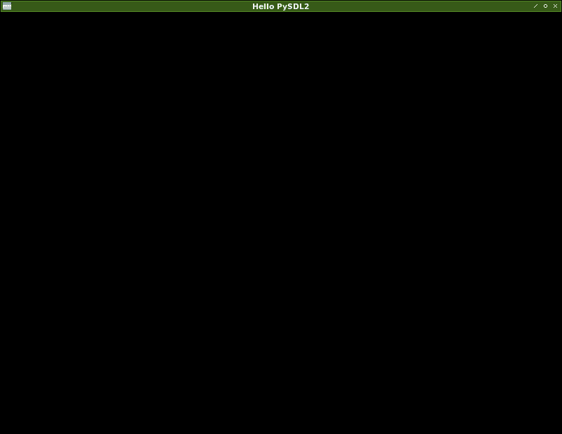

[ja](./README.ja.md)

# PySDL2.Install

Install PySDL2.

# DEMO



# Requirement

* <time datetime="2020-04-30T10:43:31+0900">2020-04-30</time>
* [Raspbierry Pi](https://ja.wikipedia.org/wiki/Raspberry_Pi) 4 Model B Rev 1.2
* [Raspbian](https://ja.wikipedia.org/wiki/Raspbian) buster 10.0 2019-09-26 <small>[setup](http://ytyaru.hatenablog.com/entry/2019/12/25/222222)</small>
* bash 5.0.3(1)-release
* SDL 2.0.9
* PySDL 0.9.7
* Python 3.7.3

```sh
$ uname -a
Linux raspberrypi 4.19.97-v7l+ #1294 SMP Thu Jan 30 13:21:14 GMT 2020 armv7l GNU/Linux
```

# Installation

```sh
sudo apt -y install libsdl2-dev libsdl2-gfx-dev libsdl2-image-dev libsdl2-mixer-dev libsdl2-ttf-dev libfreetype6 libfreetype6-dev
sudo pip install pysdl2
sudo pip3 install pysdl2
```

# Usage

```sh
git clone https://github.com/ytyaru/Python.PySDL2.Install.20200430104342
cd Python.PySDL2.Install.20200430104342/src
./run.sh
```

# Author

ytyaru

* [](https://github.com/ytyaru "github")
* [](http://ytyaru.hatenablog.com/ytyaru "hatena")
* [](https://mstdn.jp/web/accounts/233143 "mastdon")

# License

This software is CC0 licensed.

[](http://creativecommons.org/publicdomain/zero/1.0/deed.en)

